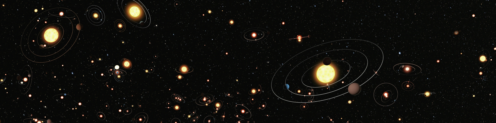
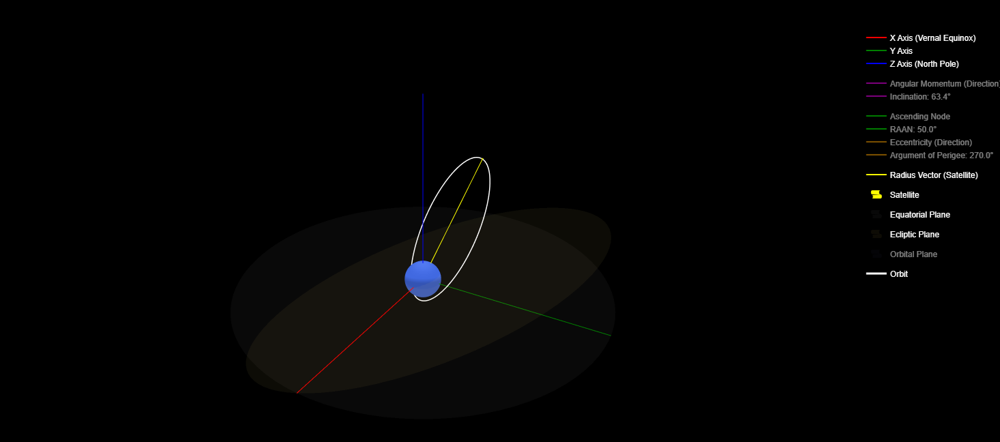
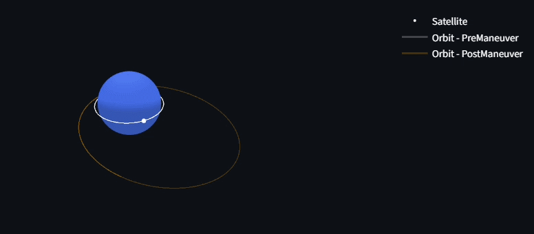

# FromPhysicsToOrbits

A Collection of small tools to Simulate and Visualise Orbits built using Streamlit and Python Libraries based on Orbital Mechanics concepts through Numerical Simulation and Analytical Equations  

This Project implements fundamental concepts from Orbital Mechanics including Orbit Propagation, Orbital Elements, Coordinate Transformation, Orbital Maneuvering

---

## 📌 2D Orbit Propagator
This App propagates a 2D Orbit by taking the Initial (X, Y) components of Position and Velocity along with Simulation Parameters - Duration and Step Size  

The Application outputs an orbit Plot along with an Animation of the Trajectory

### Features
- The Step Size is defaulted to the range (1000, 50000) to produce a better Simulation
- Numerical Integration is performed using 'DOP853' explicit Runge Kutta Integration Method 

### Upcoming
- Warn when the Orbit crashes the Planet
- Add a Few preset values which Users can directly Visualise
- Add Frame controls to Improve Animation smoothness

## 📌 3D Orbit Visualiser
This App helps the user to Visualise a 3D Orbit by entering the Orbital Elements  

Which outputs a 3D Plot of the orbit with Multiple Axes, Angles, Vectors & Planes (which can be toggled to View) 

### Features
- The Initial set of Orbital Elements belong to the Molniya Orbit
- Orbit is calculated Analytically in the Perifocal Frame and Rotated using Rotation Matrices

### Upcoming
- Visualise Orbits from 3D Position & Velocity Vector
- Directly Visualise the orbits of Satellites from Two-line Elements

## 📌 Orbital Maneuver
This App Animates the Orbital Maneuvering from Input (X, Y, Z) components of Position and Velocity which defines the Initial Orbit and takes input of simulation & Maneuver Time along with Maneuver Velocity Change  

This outputs the 3D Plot of Orbits (lighter traces) which can be Animated by clicking the Play, Pause and Reset Controls. This App also displays the new Orbital Elements after the Orbital Maneuver

### Features
- The Orbit is Numerically Simulated using the 'DOP853' method

### Upcoming
- Warn when the Orbits crash the Planet
- Enable Full Screen and View Update in Animation to make the User Experience Better

---

## Concepts Implemented
- Two Body Orbital Dynamics
- Numerical Orbit Propagation
- Orbital Elements
- Perifocal Coordinate System
- Rotation Matrices
- Coordinate Frame Transformations
- Orbital Maneuvers by using Velocity Changes

---

## Assumptions & Limitations
- Perfect Spherical Central Body
- The Trajectories intersecting Earth Surface aren't handled
- No Atmospheric Drag Effects
- No Perturbation due to J2 Oblateness
- Limited to Instantaneous Velocity Change for Maneuvering

---

## Concepts to be Added (Future)
- J2 Perturbation Effects
- TLE Data Integration
- Atmospheric Drag Models

---

## 🛠️ Tech Stack
- Python
- Streamlit
- Numpy
- Plotly
- Scipy

---

## Live Deployment
The Set of Applications are deployed using Streamlit at https://fromphysicstoorbits.streamlit.app/

---

## Credits
Professor Aniketh Kalur | IIT Madras    
Space Flight Dynamics by Craig A Kluever  

---

## Author
Mahesh Kumar Saravanan
BTech Aerospace Engineering | IIT Madras